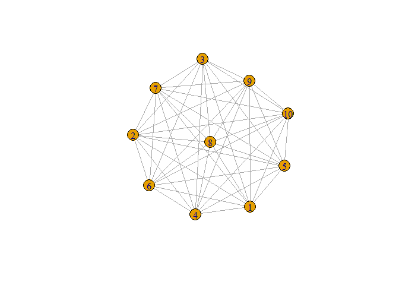

How to make a Chimera Network
================
Giulio G. Cantone
5/4/2022

This is a guide for the generating a network from a mixture of
multi-layers, in R.

I used this code for [this article Snowball
Sampling](https://arxiv.org/abs/2204.01887). You can find details of my
code in the last section of this guide.

## Packages that needed to make the grafting to work

In this guide I will install useful packages through a package called
`pacman`. If you already have these packages installed, you can ignore
this section.

### Tidyverse is my basic syntax for data wrangling.

``` r
pacman::p_install("tidyverse")
```

### Tidygraph is a syntax for networks manipulation that is inspired by tidyverse. It is built on igraph, and some operations could still be performed on igraph.

``` r
pacman::p_install("igraph")
```

``` r
pacman::p_install("tidygraph")
```

# Deterministic or stochastics graphs with igraph and tidygraph

If you feel confident in this stuff, just jump to the next section.

### Deterministic graph are exact graphs.

A deterministic graph is a graph that has an exact connecting propriety
applied over a number of nodes. For example a “complete graph” or
“clique” has the propriety that each node of the graph is connected to
each other.

In `igraph`, to construct a complete graph, you write this code:

``` r
igraph::make_full_graph(10, directed = FALSE) -> g1
g1
```

    ## IGRAPH a7de33b U--- 10 45 -- Full graph
    ## + attr: name (g/c), loops (g/l)
    ## + edges from a7de33b:
    ##  [1] 1-- 2 1-- 3 1-- 4 1-- 5 1-- 6 1-- 7 1-- 8 1-- 9 1--10 2-- 3 2-- 4 2-- 5
    ## [13] 2-- 6 2-- 7 2-- 8 2-- 9 2--10 3-- 4 3-- 5 3-- 6 3-- 7 3-- 8 3-- 9 3--10
    ## [25] 4-- 5 4-- 6 4-- 7 4-- 8 4-- 9 4--10 5-- 6 5-- 7 5-- 8 5-- 9 5--10 6-- 7
    ## [37] 6-- 8 6-- 9 6--10 7-- 8 7-- 9 7--10 8-- 9 8--10 9--10

``` r
g1 %>% plot()
```

<!-- -->

## Stochastic graphs have a random distributions of edges, following a model.

So, if you randomly generate them, you need to set a “seed” to see
always the same outcome. If you don’t, there will be a different output
each time.

``` r
set.seed(999)
igraph::random.graph.game(10, p.or.m = .2, directed = FALSE) -> g2
g2
```

    ## IGRAPH a7e805f U--- 10 10 -- Erdos renyi (gnp) graph
    ## + attr: name (g/c), type (g/c), loops (g/l), p (g/n)
    ## + edges from a7e805f:
    ##  [1] 3-- 4 5-- 7 1-- 9 2-- 9 3-- 9 5-- 9 8-- 9 2--10 7--10 9--10

``` r
g2 %>% plot()
```

<!-- -->

# If you, like me, don’t like the igraph format, tidygraph will help you

Deterministic and random graph constructor are easy to recognize in
`tidygraph` because deterministic graph generation always starts with
the verb `create_`:

``` r
tidygraph::create_complete(10) -> g1
g1
```

    ## # A tbl_graph: 10 nodes and 45 edges
    ## #
    ## # An undirected simple graph with 1 component
    ## #
    ## # Node Data: 10 x 0 (active)
    ## # ... with 4 more rows
    ## #
    ## # Edge Data: 45 x 2
    ##    from    to
    ##   <int> <int>
    ## 1     1     2
    ## 2     1     3
    ## 3     1     4
    ## # ... with 42 more rows

``` r
g1
```

    ## # A tbl_graph: 10 nodes and 45 edges
    ## #
    ## # An undirected simple graph with 1 component
    ## #
    ## # Node Data: 10 x 0 (active)
    ## # ... with 4 more rows
    ## #
    ## # Edge Data: 45 x 2
    ##    from    to
    ##   <int> <int>
    ## 1     1     2
    ## 2     1     3
    ## 3     1     4
    ## # ... with 42 more rows

while the random graphs are generated throug the verb `play_`:

``` r
set.seed(999)
tidygraph::play_erdos_renyi(10, p = .2, directed = FALSE) -> g2
g2
```

    ## # A tbl_graph: 10 nodes and 10 edges
    ## #
    ## # An undirected simple graph with 2 components
    ## #
    ## # Node Data: 10 x 0 (active)
    ## # ... with 4 more rows
    ## #
    ## # Edge Data: 10 x 2
    ##    from    to
    ##   <int> <int>
    ## 1     3     4
    ## 2     5     7
    ## 3     1     9
    ## # ... with 7 more rows

You can notice that now the format looks like `tibble` from `tidyverse`.
This is not a coincidence. This format allows to visualize the
attributes of the networks as two related tables.

Have you noticed that `g1` and `g2` have no columns under the table of
the nodes?

One could be mislead to think that this means that those nodes does not
exist! But they exists! They are the “invisible” row of the Node Data
tibble. On a second sight, you will see `10 x 0 (active)`. This means
that there are 10 nodes in the graph.

However, the tibbles of the edges has already 2 attributes: `from` and
`to`. These are very particular variables, because usually they cannot
be `mutated`. We will learn how to correct manipulate these to engraft
our Chimera Network! `from` and `to` also always point to the `rowID` of
the nodes, and if `rowID` are re-shuffled, values in `from` and `to`
will change to.

## Mutate within tidygraph!

Don’t you think that those nodes are a bit hard to recognize?

Tidygraph makes very easy to manipulate attributes in networks:

``` r
set.seed(999)
g1 %>%
  mutate(
    id =
      cur_group_rows(),
    color = sample(
    c("red", "blue"),
    n(),
    replace = T)
    ) -> g1
g1
```

    ## # A tbl_graph: 10 nodes and 45 edges
    ## #
    ## # An undirected simple graph with 1 component
    ## #
    ## # Node Data: 10 x 2 (active)
    ##      id color
    ##   <int> <chr>
    ## 1     1 red  
    ## 2     2 blue 
    ## 3     3 red  
    ## 4     4 red  
    ## 5     5 red  
    ## 6     6 blue 
    ## # ... with 4 more rows
    ## #
    ## # Edge Data: 45 x 2
    ##    from    to
    ##   <int> <int>
    ## 1     1     2
    ## 2     1     3
    ## 3     1     4
    ## # ... with 42 more rows

``` r
g1 %>% plot()
```

<!-- -->

Here 2 notes are necessary:

-   We gave an `id` to each node as the CURRENT row. This `id` is not
    related stably to values in `from` and `to`, because these always
    look for the current `row` of the row, not for a static `id`
    attribute (or any other attribute in the columns).
-   `plot()` - as ugly as it is - is a very smart guy and it recognize
    the attribute `color`!

### How can we assign attributes to the links?

Remember the weird wording `(active)`? For each `tidygraph` there is
always an active dataset: the nodes or the edges.

For assigning an attribute to the edges, we need to `activate` the
`edges`.

``` r
set.seed(999)
g1 %>% activate(edges) %>%
  mutate(color = sample(
    c("orange", "aquamarine"),
    n(),
    replace = T,
    p=c(.5,.5)
    )) -> g1
g1
```

    ## # A tbl_graph: 10 nodes and 45 edges
    ## #
    ## # An undirected simple graph with 1 component
    ## #
    ## # Edge Data: 45 x 3 (active)
    ##    from    to color     
    ##   <int> <int> <chr>     
    ## 1     1     2 aquamarine
    ## 2     1     3 orange    
    ## 3     1     4 aquamarine
    ## 4     1     5 orange    
    ## 5     1     6 orange    
    ## 6     1     7 aquamarine
    ## # ... with 39 more rows
    ## #
    ## # Node Data: 10 x 2
    ##      id color
    ##   <int> <chr>
    ## 1     1 red  
    ## 2     2 blue 
    ## 3     3 red  
    ## # ... with 7 more rows

``` r
g1 %>% plot()
```

<!-- -->

# The essence of Network Grafting:

The essence of network grafting lies in two operation:

-   Edge natural join
-   A mixing function for the nodes

## Edge full-join

We have two graphs with the same number of nodes: `g1` and `g2`. The
edges from `g2` and all of their attributes are exported and copy-pasted
into the dataset of edges `g1`.

``` r
set.seed(999)

create_star(10, directed = FALSE) %>%
    mutate(
    id = cur_group_rows(),
    color1 = sample(
      c("red", "blue"),
      n(),
      replace = T)
    ) %>%
  activate(edges) %>%
  mutate(color = "orange") -> g1
g1 %>% plot()
```

<!-- -->

``` r
play_erdos_renyi(10, p = .2, directed = FALSE) %>%
      mutate(
    id = cur_group_rows(),
    color2 = sample(
      c("red", "blue"),
      n(),
      replace = T)
    ) %>%
    activate(edges) %>%
  mutate(color = "aquamarine")-> g2
g2 %>% plot()
```

<!-- -->

``` r
g = tidygraph::graph_join(g1,g2) %>% to_undirected()
```

    ## Joining, by = "id"

``` r
g %>% plot
```

<!-- -->

``` r
g
```

    ## # A tbl_graph: 10 nodes and 20 edges
    ## #
    ## # An undirected multigraph with 1 component
    ## #
    ## # Edge Data: 20 x 3 (active)
    ##    from    to color 
    ##   <int> <int> <chr> 
    ## 1     1     2 orange
    ## 2     1     3 orange
    ## 3     1     4 orange
    ## 4     1     5 orange
    ## 5     1     6 orange
    ## 6     1     7 orange
    ## # ... with 14 more rows
    ## #
    ## # Node Data: 10 x 3
    ##      id color1 color2
    ##   <int> <chr>  <chr> 
    ## 1     1 red    blue  
    ## 2     2 blue   blue  
    ## 3     3 red    red   
    ## # ... with 7 more rows

`tidygraph::graph_join()`, for some reason, always produces a directed
graph. If you want it undirected, I added `%>% to_undirected()`.

## Mixing the attribute of the nodes

Have you noticed that in these plots, the nodes of the graphs are not
colored anymore? That’s because I named the attributes `color1` and
`color2` intead of `color`. The mixing function is for generating the
definitive `color`.

``` r
set.seed(999)
g %>% activate(nodes) %>%
  mutate(color = ifelse(color1 == color2,
                        color1,
                        "pink")) -> g
g %>% plot()
```

<!-- -->

In this case the mixing function works on a logical condition, but it
could be useful to work with numerical attributes.

## Example: Friends vs. Foe

In this example, there will be 10 kids. Each dyad is mutual, but some
kids are both friends and foes, would they be frenemies?

Each kid has a level of stress, that depends positively from the number
of foes, and negatively from the level of friends. Kids with many
friends are less stressed. There are other factors that can randomly
influence this value.

``` r
set.seed(99)

play_erdos_renyi(10, p = .4, directed = FALSE) %>%
    mutate(
    id = cur_group_rows(),
    friends = local_size()
    )%>%
  activate(edges) %>%
  mutate(color = "green") -> friends
friends %>% plot()
```

<!-- -->

``` r
play_erdos_renyi(10, p = .4, directed = FALSE) %>%
    mutate(
    id = cur_group_rows(),
    foes = local_size()
    )%>%
  activate(edges) %>%
  mutate(color = "red") -> foes
foes %>% plot()
```

<!-- -->

``` r
whole = tidygraph::graph_join(friends,foes) %>%
  to_undirected() %>%
  activate(nodes) %>%
  mutate(stress = map2_dbl(friends,foes,~rbeta(1,foes+1,friends+1))
         )
```

    ## Joining, by = "id"

``` r
whole
```

    ## # A tbl_graph: 10 nodes and 34 edges
    ## #
    ## # An undirected multigraph with 1 component
    ## #
    ## # Node Data: 10 x 4 (active)
    ##      id friends  foes stress
    ##   <int>   <dbl> <dbl>  <dbl>
    ## 1     1       4     3  0.554
    ## 2     2       6     4  0.344
    ## 3     3       3     6  0.285
    ## 4     4       4     3  0.445
    ## 5     5       6     4  0.405
    ## 6     6       2     5  0.559
    ## # ... with 4 more rows
    ## #
    ## # Edge Data: 34 x 3
    ##    from    to color
    ##   <int> <int> <chr>
    ## 1     1     2 green
    ## 2     2     4 green
    ## 3     1     5 green
    ## # ... with 31 more rows

A `beta` function is employed to generate the random value. Why the
`map2_dbl`? Well, if you proceed with a regular mutate without mapping
the random-generative function, R would interpret it as the call is to
repeat one random generated number for all the `rows` of the node
dataset.

Usually, there is a easier way than `map`, that is to employ
`rowwise() %>%` before the `mutate`, but `tidygraph` do not understand
`rowwise`, unfortunately.

# How to generate a smokers’ network

This is the code that I employed for [generating a network of smokers in
Hybrid Probabilistic-Snowball
Sampling](https://arxiv.org/abs/2204.01887). I called this Chimera
Network “Clique-and-block”, because of the two collapsing layers:

-   one is a population of cliques, full connected within, and not
    connected between;
-   the other layer is randomly generated stochastic blockmodel

## Cliques

The underlying assumption behind this kind of network is that nodes are
connected in cliques, representing their households. A household could
be only one node - someone living alone.

This is only the `g1` of the final network

``` r
# Section 1
n = 46

tibble(k = rpois(n,1.2)+1,
       clique = 1:n) -> g1

# Section 2
tibble(
  w = .4,
  clique = rep(g1$clique,g1$k)  %>% sample()) %>%
  mutate(name = cur_group_rows()) %>%
  group_by(clique) %>%
  mutate(alpha = VGAM::rbetabinom(1,9,.225,.3),
         alpha = (alpha/10) + .05) %>%
  ungroup() -> g1

#Section 3
g1 %>% with(
    .,
    do.call(
      rbind,
      Map(
        function(v) {
          get.data.frame(
            set_vertex_attr(
              make_full_graph(length(v)),
              name = "name", value = v
            )
          )
        },
        split(name, clique)
      )
    )
  ) %>% tbl_graph(g1,.,directed = F) %>%
  activate(edges) %>% mutate(color = "red") %>%
  activate(nodes) %>% mutate(name = as.character(name)) %>%
  arrange(name) -> g1

g1
```

    ## # A tbl_graph: 93 nodes and 72 edges
    ## #
    ## # An undirected simple graph with 46 components
    ## #
    ## # Node Data: 93 x 4 (active)
    ##       w clique name  alpha
    ##   <dbl>  <int> <chr> <dbl>
    ## 1   0.4     43 1      0.25
    ## 2   0.4     11 10     0.35
    ## 3   0.4     28 11     0.55
    ## 4   0.4     12 12     0.05
    ## 5   0.4     21 13     0.05
    ## 6   0.4     30 14     0.25
    ## # ... with 87 more rows
    ## #
    ## # Edge Data: 72 x 3
    ##    from    to color
    ##   <int> <int> <chr>
    ## 1    19    51 red  
    ## 2    28    46 red  
    ## 3    28    84 red  
    ## # ... with 69 more rows

The code is divided in three sections:

-   Section 1 generates 100 `cliques`. Each clique has a size that is
    randomly draw from a shifted Poisson.
-   Section 2 generates `100*sizes` nodes that are fully connected
    within the cliques, and not connected across cliques. Each clique is
    associated to a `alpha` fixed within the clique. This `alpha` is a
    determinant to the propensity to smoke.
-   Section 3 generates exactly all the edges. These edges are colored
    of `red`. `name` is the `id` of the node. This code was ‘gifted’ to
    me from the author of `tidyverse`, [Thomas
    Pedersen](https://github.com/thomasp85).

## Blockmodel

Generating a blockmodel is a bit harder, but it can be made simple with
a package from \[[Alex Hayes and Karl
Rohe](https://github.com/RoheLab/fastRG), `fastRG`.

``` r
pacman::p_load("fastRG")
```

Everything you have to know about random generation of a blockmodel of
*beta*-blocks is that you need only 4 ingredients to make one:

-   Number of *nodes*… we got it from g1!
-   A *pi* vector of probabilities. Each element is the quota of nodes
    that will fall into the *beta*-block
-   A mixing matrix, that is the matrix with the probabilities that
    edges will connect two blocks (or, the same block)
-   A parameterisation for the expectation of the number of *edges* in
    the generated blockmodel. `fastRG` would set the default for a
    Poisson model, so it only need a parameter that will be the expected
    number. For example, if this number is set `5`, the average number
    of edges per node will be 5.

### In a smoking networks, blocks represent the second determinant of smoking.

We will assign some `beta` values to each block. The function of `beta`
is analogues to the `alpha` in the cliques. Do you remember the function
of `color1` and `color2`? So the higher is the `beta` of the block, the
higher the propensity for the node to be a smoker, mediated by the value
of `alpha` of its clique.

We want to model two features of smoking networks:

-   They are homophile (or, assortative networks). This means that it’s
    easier for a node in a block to be connected to a node to a block
    with a simular (or, identical) `beta`
-   Higher `beta`-blocks are less connected.

To model these features, I coded this Mixing Matrix:

``` r
pacman::p_load(Matrix,superheat)

gamma = .45

map_dfc(
  seq(1,10,1),
  function(.x) {
    (dnorm(seq(1,10,1),.x,.x))}
) |> as.matrix() |>
  forceSymmetric(uplo = "U") |>
  as.matrix() -> B

B/sum(B) -> B
(B^gamma / sum(B^gamma)) -> G

colnames(G) <- (seq(.05,.95,.1))
rownames(G) <- (seq(.05,.95,.1))

G %>% superheat(
  X.text = round(G, 3),
  X.text.size = 3,
  legend = FALSE,
  X.text.col = "white")
```

<!-- -->

Thanks to the useful package `superheat` we can visualize the mixing
matrix that associates the frequence of nodes connecting a couple of two
`beta`-blocks. This matrix is regulated through a `gamma` parameter. The
higher the `gamma`, the higher will be the homophily in the network.
According to my calibration, `gamma` should not exceed 1.

### Now, we only need a pi-vector of probabilities for beta-blocks!

Only for demonstrative purposes, without digging into precise tuning, we
will pick a very easy parameterisation that `fastRG` will
re-parameterize as probabilities:

``` r
pi = (dbinom(0:9,9,.35))+0.02
pi %>% round(3)
```

    ##  [1] 0.041 0.120 0.236 0.292 0.239 0.138 0.062 0.030 0.021 0.020

A consequence of this `pi` is that the probability to see nodes being
assigned to higher `beta` is very small! So nodes in the tenth block are
not only much less connected than others, they are very unlikely to be
connected outside their cliques!

But `beta` and `alpha` are the determinants of the smoking status, so if
you think about these mechanics, you will see that this generate an
interesting features of smoking networks: people with a very high
propensity to be a smoker fall both in a high-`beta` block and in a
clique with high `alpha`: these will be very isolated nodes, and likely
connected with other people with high propensity to smoke!

# Engraft the Smoking Chimera Network

Now we have all the elements for the second layer of the Chimera, the
blockmodel.

`fastRG` works in a way that it will generate a latent model as a `R`
object, than the command `sample_tidygraph` would generate the
`tidygraph` graph. Before it, we will need to export the `block`
variable into the Chimera network to assign the `beta` attribute.

``` r
latent_sbm <- fastRG::sbm(
  n = V(g1) %>% length(),
  pi = pi,
  B = G,
  expected_degree = 5,
  sort_nodes = T
)

g1 %>% activate(nodes) %>%
  mutate(
    beta = latent_sbm$z,
    beta = abs((str_remove(beta,"block") %>%
                  as.integer()) - 10)/10 + .05
  ) -> g1

g1
```

    ## # A tbl_graph: 93 nodes and 72 edges
    ## #
    ## # An undirected simple graph with 46 components
    ## #
    ## # Node Data: 93 x 5 (active)
    ##       w clique name  alpha  beta
    ##   <dbl>  <int> <chr> <dbl> <dbl>
    ## 1   0.4     43 1      0.25  0.95
    ## 2   0.4     11 10     0.35  0.85
    ## 3   0.4     28 11     0.55  0.85
    ## 4   0.4     12 12     0.05  0.75
    ## 5   0.4     21 13     0.05  0.75
    ## 6   0.4     30 14     0.25  0.75
    ## # ... with 87 more rows
    ## #
    ## # Edge Data: 72 x 3
    ##    from    to color
    ##   <int> <int> <chr>
    ## 1    19    51 red  
    ## 2    28    46 red  
    ## 3    28    84 red  
    ## # ... with 69 more rows

``` r
g2 = fastRG::sample_tidygraph(latent_sbm) %>%
  activate(edges) %>% mutate(color = "orange")
```

Now we have only to engraft the edges of `g2` into `g1`. Done this, we
can generate a risk factor through a simple mixing function:

*r**i**s**k* = *α* \* *w* + *β* \* (1 − *w*)

… that justificate the previous setup of a parameter `w`.

``` r
g = graph_join(g1,g2) %>% to_undirected()
```

    ## Joining, by = "name"

``` r
g %>% activate(nodes) %>%
  mutate(risk = alpha*w + beta*(1-w),
         smoker = map_dbl(risk,~rbinom(1,1,.x)),
         color = ifelse(smoker==1,"green","white")
  ) -> g

g
```

    ## # A tbl_graph: 93 nodes and 326 edges
    ## #
    ## # An undirected multigraph with 1 component
    ## #
    ## # Node Data: 93 x 8 (active)
    ##       w clique name  alpha  beta  risk smoker color
    ##   <dbl>  <int> <chr> <dbl> <dbl> <dbl>  <dbl> <chr>
    ## 1   0.4     43 1      0.25  0.95  0.67      0 white
    ## 2   0.4     11 10     0.35  0.85  0.65      1 green
    ## 3   0.4     28 11     0.55  0.85  0.73      0 white
    ## 4   0.4     12 12     0.05  0.75  0.47      1 green
    ## 5   0.4     21 13     0.05  0.75  0.47      0 white
    ## 6   0.4     30 14     0.25  0.75  0.55      1 green
    ## # ... with 87 more rows
    ## #
    ## # Edge Data: 326 x 3
    ##    from    to color
    ##   <int> <int> <chr>
    ## 1    19    51 red  
    ## 2    28    46 red  
    ## 3    28    84 red  
    ## # ... with 323 more rows

``` r
g %>% plot()
```

<!-- -->

### The plot is a mess!

In this case, we will swtich to a better graphical too, `ggraph`:

``` r
library(ggraph)
g %>% ggraph(layout = "stress") +
  geom_edge_link(aes(colour = color,
                    width = color)) +
  geom_node_point(aes(fill = color),
                  size = 7, shape = 21, stroke = 1, color = 'black') +
  scale_fill_manual(values = c("white" = "white",
                               "green" = "forestgreen")) +
  scale_edge_color_manual(values = c("red" = "red",
                                     "orange" = "orange"))+
  geom_node_text(aes(label = name))+
  scale_edge_width_manual(values = c(
    "red" = 1,
    "orange" = .5)) +
  theme_void() +
  theme(legend.position="none") 
```

<!-- -->
